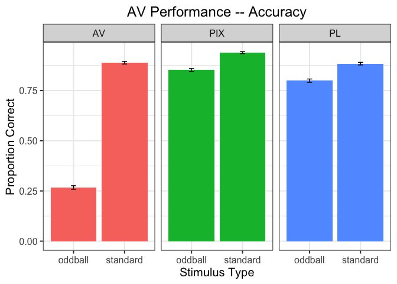
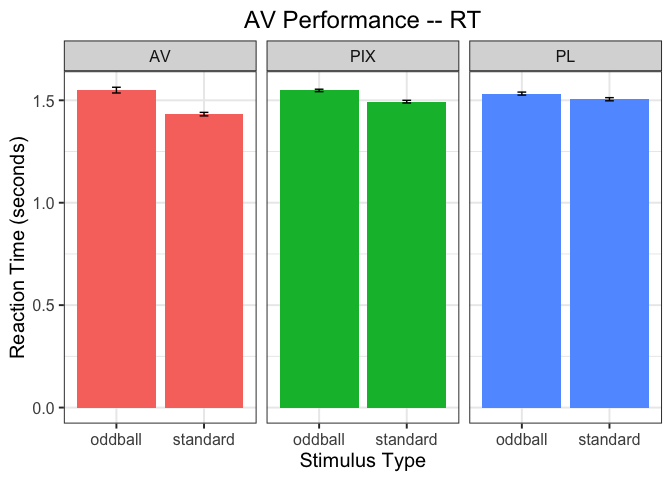
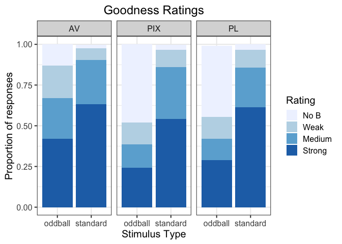

AV Integration PL Behavioral Task
================

This document will take you through how I analyzed the data collected
for this experiment. I’ll try my best to keep all of the code carefully
commented and explained.

Load libraries. Libraries give us functions that are not automatically
built into R. If you don’t already have a library installed, you will
have to use the function `install.packages()`.

``` r
library(tidyverse) # best package ever
library(kableExtra)
```

Now we will set our working directory. This is where R will look for and
save files. You should change this path to one that is relevant for you.

``` r
setwd("~/a204/AVIntegration/DataAnalysis")
```

## Reading in Data

Next, I will load in the data. The next few steps are a little confusing
so I will try to go through them
carefully.

``` r
twoafc_files <- list.files(path = "./dataApril2019", pattern=".*2AFC.*\\.tsv", full.names = TRUE)
```

In the above step, we are trying to get R to find all of the data files
for the 2AFC task.

First, we tell it where to look with the `path` argument. It should be
looking in the folder `dataApril2019`, which is located in our current
directory (signified with a `.`).

Next, we tell it what type of filename to look for. All of our AV
Integration data files have the structure `AVInt_2AFC_sub-?.tsv`. To
simplify, we can just look for `.tsv` files that contain `2AFC`. To do
this, we are using Regular Expressions (regex).
[Here](https://stat545.com/block022_regular-expression.html) is a useful
page with information about regular expressions in R.

The last argument gives us the full filename paths rather than just
their names, which is important because we are working with files that
are in a different folder than our working directory.

Regular expressions are just ways to look for certain patterns in
text/strings. They have some special syntax to allow for different
patterns.

The `.` matches a single character. The `*` modifies the `.` to any
number of characters. Together, `.*` basically means “match anything.”
So, our pattern `.*2AFC.*` means “match anything with the string `2AFC`
in it.”

Next, we have this pattern: `\\.tsv`. The backslash `\` is a special
character in R. It is known as an escape character. If you want to match
a character that usually has a special function (for example, you want
to find filenames that actually have a `*` in them), you use the `\`. R
has a special quirk where you often have to use a double backslash to
indicate that you actually want to use it as an escape character. So,
since the `.` has a special meaning for regexes, we use the double
backslash to tell R that we are actually interested in finding files
that include a `.`. Thus, `\\.tsv` means “match files that contain
`.tsv`.”

Putting it together, the full pattern we are looking to find is files
that contain `2AFC` and `.tsv`. If we look at all of the filenames that
this command gets at, we can see it’s all of the data files for the 2AFC
task.

``` r
twoafc_files
```

    ##  [1] "./dataApril2019/AVInt_2AFC_sub-100.tsv"
    ##  [2] "./dataApril2019/AVInt_2AFC_sub-108.tsv"
    ##  [3] "./dataApril2019/AVInt_2AFC_sub-112.tsv"
    ##  [4] "./dataApril2019/AVInt_2AFC_sub-117.tsv"
    ##  [5] "./dataApril2019/AVInt_2AFC_sub-120.tsv"
    ##  [6] "./dataApril2019/AVInt_2AFC_sub-154.tsv"
    ##  [7] "./dataApril2019/AVInt_2AFC_sub-157.tsv"
    ##  [8] "./dataApril2019/AVInt_2AFC_sub-159.tsv"
    ##  [9] "./dataApril2019/AVInt_2AFC_sub-163.tsv"
    ## [10] "./dataApril2019/AVInt_2AFC_sub-172.tsv"
    ## [11] "./dataApril2019/AVInt_2AFC_sub-174.tsv"
    ## [12] "./dataApril2019/AVInt_2AFC_sub-178.tsv"
    ## [13] "./dataApril2019/AVInt_2AFC_sub-181.tsv"
    ## [14] "./dataApril2019/AVInt_2AFC_sub-182.tsv"
    ## [15] "./dataApril2019/AVInt_2AFC_sub-183.tsv"
    ## [16] "./dataApril2019/AVInt_2AFC_sub-185.tsv"
    ## [17] "./dataApril2019/AVInt_2AFC_sub-188.tsv"
    ## [18] "./dataApril2019/AVInt_2AFC_sub-211.tsv"
    ## [19] "./dataApril2019/AVInt_2AFC_sub-215.tsv"
    ## [20] "./dataApril2019/AVInt_2AFC_sub-218.tsv"
    ## [21] "./dataApril2019/AVInt_2AFC_sub-219.tsv"
    ## [22] "./dataApril2019/AVInt_2AFC_sub-225.tsv"
    ## [23] "./dataApril2019/AVInt_2AFC_sub-233.tsv"
    ## [24] "./dataApril2019/AVInt_2AFC_sub-245.tsv"
    ## [25] "./dataApril2019/AVInt_2AFC_sub-246.tsv"
    ## [26] "./dataApril2019/AVInt_2AFC_sub-248.tsv"
    ## [27] "./dataApril2019/AVInt_2AFC_sub-251.tsv"
    ## [28] "./dataApril2019/AVInt_2AFC_sub-254.tsv"
    ## [29] "./dataApril2019/AVInt_2AFC_sub-255.tsv"
    ## [30] "./dataApril2019/AVInt_2AFC_sub-259.tsv"
    ## [31] "./dataApril2019/AVInt_2AFC_sub-263.tsv"
    ## [32] "./dataApril2019/AVInt_2AFC_sub-271.tsv"
    ## [33] "./dataApril2019/AVInt_2AFC_sub-272.tsv"
    ## [34] "./dataApril2019/AVInt_2AFC_sub-278.tsv"
    ## [35] "./dataApril2019/AVInt_2AFC_sub-279.tsv"
    ## [36] "./dataApril2019/AVInt_2AFC_sub-298.tsv"
    ## [37] "./dataApril2019/AVInt_2AFC_sub-30.tsv" 
    ## [38] "./dataApril2019/AVInt_2AFC_sub-300.tsv"
    ## [39] "./dataApril2019/AVInt_2AFC_sub-33.tsv" 
    ## [40] "./dataApril2019/AVInt_2AFC_sub-35.tsv" 
    ## [41] "./dataApril2019/AVInt_2AFC_sub-38.tsv" 
    ## [42] "./dataApril2019/AVInt_2AFC_sub-41.tsv" 
    ## [43] "./dataApril2019/AVInt_2AFC_sub-53.tsv" 
    ## [44] "./dataApril2019/AVInt_2AFC_sub-58.tsv" 
    ## [45] "./dataApril2019/AVInt_2AFC_sub-7.tsv"  
    ## [46] "./dataApril2019/AVInt_2AFC_sub-70.tsv" 
    ## [47] "./dataApril2019/AVInt_2AFC_sub-84.tsv" 
    ## [48] "./dataApril2019/AVInt_2AFC_sub-99.tsv"

Now that we have found all of the files we want to load in, we are going
to have R load them in and paste them all into a single big file. We are
going to use the `rbind()` function in a loop to do this. `rbind()`
stands for row bind, which means that it will paste all of the files
vertically since they have the same column names.

We are using some nested functions below. First, we are using `lapply()`
to apply the function `read.delim()` to each of the files in our
`twoafc_files` list. Basically, it is saying “please read in each of the
files listed in `twoafc_files`.”

Next, we are using `do.call()` to run `rbind()` after we read each file
in. So with the code below, we will read in each file and add it to the
master data
file.

``` r
twoafc <- do.call(rbind, lapply(twoafc_files, function(x) read.delim(x)))
```

Let’s look at some of this
data.

| Subject | Block | Trial | StimType | StimCategory | Stimulus                 | ACC | RESP | Sound |    RT |
| ------: | ----: | ----: | :------- | :----------- | :----------------------- | --: | :--- | :---- | ----: |
|     100 |     1 |     1 | standard | AV           | ba\_base\_face\_w960.avi |   1 | j    | BA    | 1.517 |
|     100 |     1 |     2 | oddball  | AV           | ba\_redu\_face\_w960.avi |   0 | j    | BA    | 1.464 |
|     100 |     1 |     3 | standard | AV           | ba\_base\_face\_w960.avi |   1 | j    | BA    | 1.849 |
|     100 |     1 |     4 | standard | AV           | ba\_base\_face\_w960.avi |   1 | j    | BA    | 1.453 |
|     100 |     1 |     5 | oddball  | AV           | ba\_redu\_face\_w960.avi |   0 | j    | BA    | 1.493 |

Now we are going to read in the goodness rating task data with the same
method.

``` r
goodness_files <- list.files(path = "./dataApril2019", pattern=".*goodness.*\\.tsv", full.names = TRUE)
good <- do.call(rbind, lapply(goodness_files, function(x) read.delim(x)))
```

## Descriptive Plots

Now that we have our data, we should take a look at
it.

``` r
ggplot(data=twoafc, aes(StimType, ACC, fill = StimCategory)) + # x axis = StimType, y axis = ACC, bar color = StimCategory
  stat_summary(fun.y=mean, geom="bar",position=position_dodge(width=.1)) + # create bars by finding the mean for each stim type and category
  stat_summary(fun.data=mean_se, geom="errorbar",width=.1,position=position_dodge(width=.1)) + # create error bars
  labs(x="Stimulus Type",y="Proportion Correct") + # label the x and y axes
  facet_grid(.~StimCategory) + # break it down by Stim Category
  ggtitle("AV Performance -- Accuracy") + # title the plot
  theme_bw(15) + # make it look prettier and make the font size be 15
  theme(plot.title = element_text(hjust = 0.5), legend.position = "none") # center the plot title and remove the legend
```

<!-- -->

Here we can see a clear AV integration effect in the AV task –
participants are often saying that the A sound is a BA, leading to low
accuracy in the AV-oddball condition. Otherwise, participants are pretty
accurate.

``` r
twoafc %>%
  dplyr::filter(ACC == 1, RT > 0, RT != 999) %>% # select only correct trials where the RT is positive and not invalid (non-response trials were coded as 999)
  ggplot(., aes(StimType, RT, fill = StimCategory)) + # x-axis = StimType, y-axis = RT, bar color = StimCategory
  stat_summary(fun.y=mean, geom="bar",position=position_dodge(width=.1)) + # create bars by finding the mean for each stim type and category
  stat_summary(fun.data=mean_se, geom="errorbar",width=.1,position=position_dodge(width=.1)) + # create error bars
  labs(x="Stimulus Type",y="Reaction Time (seconds)") + # Label the x and y axes
  facet_grid(.~StimCategory) + # break it down by Stim Category 
  ggtitle("AV Performance -- RT") + # title the plot
  theme_bw(15) + # make it look prettier and make the font size be 15
  theme(plot.title = element_text(hjust = 0.5), legend.position = "none") # center the plot title and remove the legend
```

<!-- -->

We don’t really see any effects in reaction time.

Let’s look at the goodness
data.

``` r
num_subs <- length(unique(good$Subject)) # find the number of subjects who did this task
good_summary <- good %>%
  filter(RT != 999, Rating != "No Rating", RT > 0) %>% # remove trials where the participant did not answer in time
  group_by(StimType, StimCategory, Rating) %>% # group by stim type, category, and rating
  count() %>% # count the number of each
  mutate(pct = n/(9*num_subs)) # calculate what percentage of the total trials each of these answers were

good_summary %>%
  ungroup() %>% # remove the group_by above
  mutate(Rating = fct_relevel(Rating, "No B", "Weak", "Medium", "Strong")) %>% # reorder the rating factor
  ggplot(., aes(StimType, pct, fill = Rating)) + # x-axis = stim type, y-axis = percentage, bar color = rating type
  geom_bar(stat = "identity") + # plot stacked bars
  facet_grid(.~StimCategory) + # break it down by stim category
  theme_bw(15) + # make the plot pretty and size 15 font
  scale_fill_brewer(palette = "Blues") + # make the colors shades of blue
  ggtitle("Goodness Ratings") + # add a title
  labs(x="Stimulus Type",y="Proportion of responses") + # label the axes
  theme(plot.title = element_text(hjust = 0.5)) # center the plot title
```

<!-- -->

These results are very similar to what we see in the 2AFC task. For the
AV trials, the oddball stimulus (A) is more often perceived as some sort
of a B, while in point-light and pixelated this stimulus is considered
to not even have a B about 50% of the time. In contrast, all of the
conditions show either strong or medium B sounds for most of the trials.
