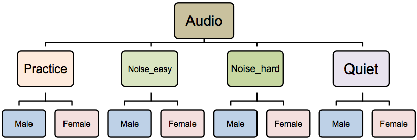
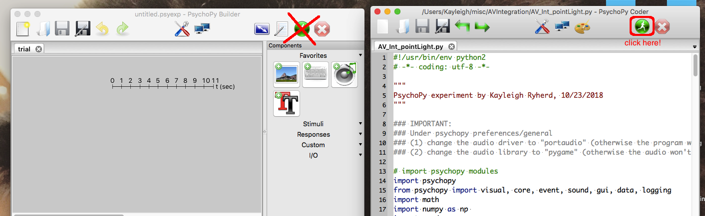
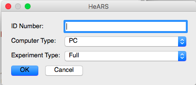

# Audio-Visual Integration

This folder contains the behavioral PsychoPy version of the HeARs task.

### Contents:
* `hears_skel.py` - this is the PsychoPy experiment.
* `audio` - contains audio files
* `pictures` - contains picture files
* `stim` - contains stimulus files. If you want to change which pictures or sounds appear, look at the files in here.

## Directory Structure

It is important when updating stimuli to make sure that files are in the right folders. This will ensure that the experiment knows what files to pull at the correct time.

### Audio Stimuli

The audio stimuli can all be found in the `audio` directory. Within that folder, there is a subfolder for each type of stimulus -- `practice`, `noise_easy`, `noise_hard`, and `quiet`. Finally, under each of these subfolders is a subfolder for the two speaker genders. 

**Important Notes:**

* Gender is randomly selected, so the Male and Female folders for any given stimulus type should be identical. For example, if you have `bake.mp3` and `ball.mp3` for the male speaker under `quiet`, you should have `bake.mp3` and `ball.mp3` with the female speaker in `quiet` as well. Note that speaker gender is not coded in the filename, *only* in the folder name. So make sure you are copying the right files into each folder.

### Picture Stimuli

All of the pictures are just in this folder -- no crazy structure to deal with here.

## Experiment Structure

The experiment has two blocks: practice and test. 

### Practice Block

In the practice block, participants are instructed to use the arrow keys to pick the picture that matches the word they heard. Images are randomly placed in one of four locations on the screen (top, bottom, left, right). The speaker gender is randomly selected.

Participants have 5 seconds to respond once the stimulus appears on the screen. After they respond, they will get feedback (Correct, Incorrect, or Too Slow). This feedback is presented for 500ms before the task moves onto the next trial.

To modify the practice stimuli, edit the file called `practice_stim.csv` in the `stim` folder. You can add more rows if you want more than 5 practice trials. Make sure that the audio files for the practice trials are copied to the male and female folders in the `practice` directory.

### Test Block

The test trials work the same as the practice trials except that participants no longer receive feedback. There are three types of trials: `quiet` (no noise), `noise_easy` (+3dB), and `noise_hard` (-3dB). *Note: I'm not sure which dB value actually maps to the `noise_easy`/`noise_hard` conditions, so if this is incorrect, please disregard.* 

Trials are randomly presented, with all three trial types being presented in a single block. Participants have 5 seconds to respond. There is a 250ms ITI.

To modify the test stimuli, edit the file called `stim_list.csv` in the `stim` folder. You can add more rows if you want more than trials. Make sure that the audio files are copied to the male and female folders in the appropriate directories. You can also modify the `stim_list_clip.csv` file to make a shorter version of the stim list to help you troubleshoot the task.

Results files for this task are labeled `HeARS_sub-XXXX.csv` in the `results` directory.

## How to Run

0. Make sure you have [PsychoPy](http://psychopy.org/installation.html) up an running on your computer. This will include installing Python 2.7.   
1. Download the `a204` respository by going to [this](https://github.com/kryherd/a204) page and clicking Clone or Download (green button).
2. Copy the `HEARS` folder into your desired location. (You can delete the other folders).
3. Open PsychoPy.
4. Click View > Open Coder View.
5. Click File > Open... and select the `hears_skel.py` file.
6. Click the little green man to run. **IMPORTANT:** Make sure you are running from the **CODER** view, **not** the Builder view. You should see the code pop up in Coder View before you run. See below.

7. A dialog box should pop up (like the one below). 

* ID Number: Participant Number
* Computer Type: Select either PC or Mac, depending on which type of computer you are using.
* Experiment Type: This allows you to run either the full experiment (Full) or a shortened version (Clipped) for testing it out. All experimental participants should be run using Full, but if you want to check something quickly or demo the experiment, you can use Clipped.

8. From there the experiment should run pretty smoothly. Read through the instructions with the participant.
9. If at any point you need to quit the experiment unexpectedly, press the `ESCAPE` key. This will stop after the next trial. The data you have collected so far will be saved as `early_quit_sub-XXXX.csv`. This only works during the actual trials, not during instruction screens.

Contact me at [kayleigh.ryherd@gmail.com](mailto:kayleigh.ryherd@gmail.com) if you have any issues.
